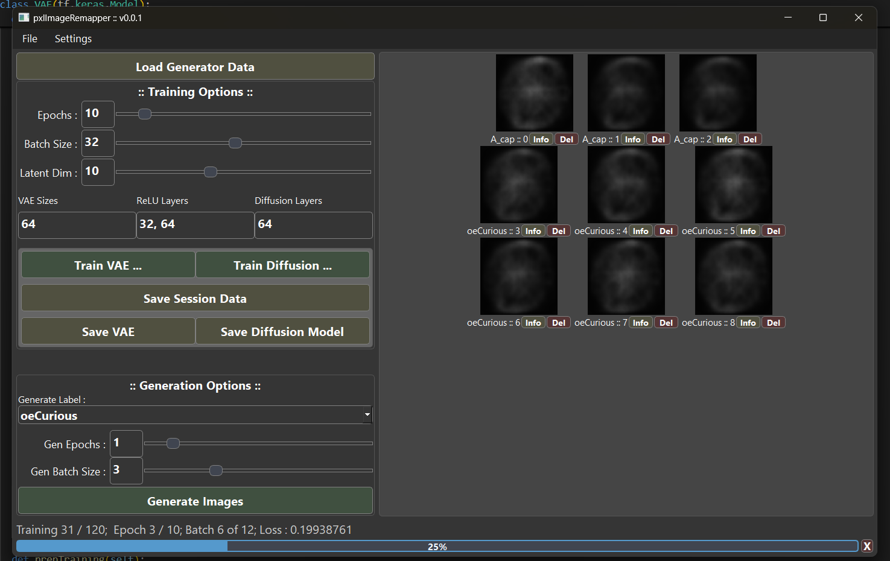

# pxlImageRemapper :: v0.0.1
### Small batch VAE & Diffusion model training/generation
&nbsp;

### What's it do?
Train a model from the ground up on your own images and labels.
 &nbsp;

### Purpose?
Written to visualize how VAE encoders and decoders learn from training material, along with how Diffusion models generate.
 &nbsp; While training on your own images and labels.

 *Note*:
 This project is early on, training and generation is buggy
 &nbsp;

---

### Header ripped from `main.py`
Diffusion models exist... Why is this a thing?     
&nbsp; More of a learning experience than anything else.

Visualize how ai's learn latent space encodings and can be used to generate your own ai images.      
With custom levels of training and generation,
 &nbsp; You can create your own unique images based on the specfic labels your model is trained on.     

Should you have a collection of images you want to create a custom stand-alone model for,
 &nbsp; This is a good place to start for that!        
 If not, I provided a sample set of hand written letters to get you started.
 &nbsp; You can find them in `./input`

---
